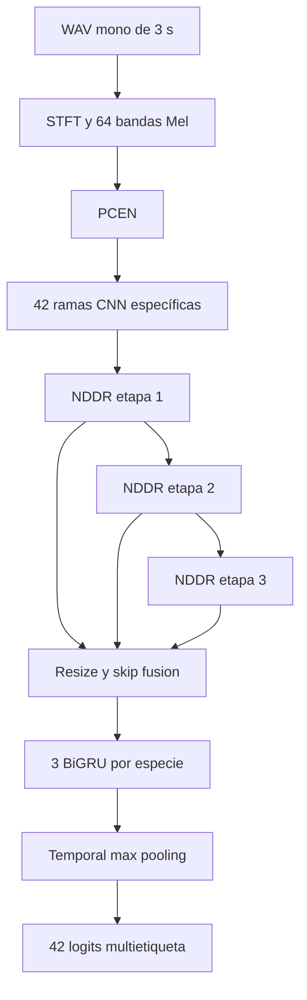

# Implementación de NDDR-MTL para reconocimiento de animales

## 1. Método seleccionado

El trabajo implementa únicamente **Neural Discriminative Dimensionality
Reduction Multi-Task Learning (NDDR-MTL)**. NDDR-MTL mantiene una ruta de
características específica para cada tarea y permite intercambio controlado de
información entre las rutas mediante convoluciones `1×1` aprendibles.

Para cada etapa convolucional, las características de las `K` tareas se
concatenan:

```text
X = concat(X_1, X_2, ..., X_K)
```

Cada tarea obtiene una nueva representación:

```text
Y_k = Conv1x1_k(BatchNorm(X))
```

La inicialización favorece la propia tarea y asigna pesos menores a las demás.
Esto permite especialización por especie sin eliminar las correlaciones entre
especies que aparecen simultáneamente.

## 2. Pipeline implementado



Cada bloque CNN utiliza:

1. Convolución `5×5` con padding.
2. Batch normalization.
3. ReLU.
4. Max pooling no solapado.
5. Dropout 0.25.
6. Fusión NDDR con convoluciones `1×1`.

Después de la tercera etapa, las salidas de las tres capas NDDR se redimensionan
a la resolución de la última etapa y se fusionan con pesos iniciales
`[0.2, 0.2, 0.6]`. Cada especie tiene tres capas GRU bidireccionales. Las dos
direcciones se promedian, se aplica temporal max pooling y se produce un logit.

## 3. Representación del audio

El paper usa MS-PCEN sobre audio de 96 kHz con:

- STFT de 2048 muestras.
- Solapamiento de 75 %.
- 64 bandas Mel.
- Tres copias del espectrograma.

Como el dataset del laboratorio usa 22.05 kHz, se preservó aproximadamente la
duración física de la ventana del paper:

| Parámetro               |  Paper | Adaptación |
|-------------------------|-------:|-----------:|
| Frecuencia de muestreo  | 96 kHz |  22.05 kHz |
| `n_fft` / ventana       |   2048 |        512 |
| Hop                     |    512 |        128 |
| Solapamiento            |   75 % |       75 % |
| Bandas Mel              |     64 |         64 |
| Frames para 3 s         |    559 |        513 |

Parámetros PCEN:

- `offset = 0.05`
- `gain = 0.98`
- `power = 0.5`
- `eps = 1e-4`
- `smoothing = 0.967`

El suavizado se interpreta como:

```text
M_t = 0.967 M_(t-1) + 0.033 E_t
```

Y PCEN como:

```text
PCEN(E) = (E / (eps + M)^gain + offset)^power - offset^power
```

El frontend fue implementado en PyTorch, incluyendo el banco triangular Mel.

## 4. Adaptación de cinco a 42 tareas

La versión principal del paper usa cinco clases, 64 canales CNN y 128 unidades
GRU, con aproximadamente 4.1 millones de parámetros. Replicar esas dimensiones
con 42 rutas incrementa notablemente memoria y tiempo porque NDDR mezcla todas
las tareas en cada etapa.

El preset del laboratorio conserva toda la estructura de NDDR-MTL pero usa:

- 42 ramas.
- 4 canales por rama.
- 16 unidades GRU por dirección.
- Tres etapas CNN y tres BiGRU.
- Aproximadamente **500,682 parámetros**.

El propio paper reporta una meseta de desempeño desde aproximadamente 410 mil
parámetros y el preset compacto queda cerca de ese conteo agregado. Esto motiva
el presupuesto, pero no demuestra capacidad equivalente: los parámetros ahora
se distribuyen entre 42 rutas y el resultado debe validarse empíricamente.

### Inicialización cruzada

Con cinco tareas, el paper usa 0.6 para la ruta propia y 0.1 para cada una de las
otras cuatro rutas; la suma es 1.0. Copiar 0.1 para 41 rutas produciría una suma
inicial de 4.7.

Para 42 tareas se mantiene 0.6 en la ruta propia y se distribuye 0.4 entre las
41 rutas restantes:

```text
cross_weight = (1 - 0.6) / 41 = 0.009756...
```

Este cambio preserva la prioridad de la tarea y la escala total de la
inicialización original. El valor sigue siendo configurable.

## 5. Adaptación multietiqueta

La salida tiene 42 logits independientes. Un vector de ceros representa que no
se detectó ninguna especie; no se añadió una clase artificial de ruido.

La pérdida es:

```text
BCEWithLogitsLoss
```

Se ofrece BCE sin pesos y BCE con `pos_weight = negativos / positivos`, limitado
a `[1, 20]`. El experimento principal usa pesos porque el dataset entregado no
fue curado/balanceado como el dataset experimental del paper.

Dos columnas, `SCIFUS` y `SCINAS`, no tienen ejemplos positivos en
`train.csv`. Se mantienen para conservar las 42 salidas, reciben peso 1.0 y se
reportan como clases sin soporte. No se incluyen en mAP ni en promedios macro
que requieran ejemplos positivos.

## 6. Split de entrenamiento y validación

Se utiliza 80 % para entrenamiento y 20 % para validación con semilla **42**.

Los clips son ventanas solapadas de grabaciones más largas. Por ejemplo,
`_0_3.wav` y `_1_4.wav` comparten dos segundos. Una división aleatoria por clip
produciría fuga de información.

La implementación:

1. Elimina el sufijo `_inicio_fin` para obtener el grupo de grabación.
2. Genera candidatos con `GroupShuffleSplit`.
3. Descarta candidatos que dejarían sin positivos de entrenamiento a una clase
   globalmente soportada.
4. Descarta candidatos sin soporte de validación cuando la clase aparece en al
   menos dos grabaciones independientes.
5. Verifica que ningún grupo aparezca en ambos conjuntos.
6. Reporta clases globalmente vacías, restringidas a una grabación o ausentes
   de validación.
7. Guarda el split para reutilizarlo en todos los experimentos.

## 7. Entrenamiento

Configuración principal:

- Adam, `lr = 1e-3`.
- Decaimiento staircase de 0.75 cada media época aproximadamente.
  El intervalo se escala con los pasos por época para conservar la cadencia
  relativa de 90 pasos sobre ~182 pasos/época usada en el paper; también puede
  fijarse literalmente con `training.lr_decay_steps`.
- Batch 64, seleccionado mediante benchmark en la RTX A2000 de 12 GB.
- AMP en CUDA.
- Gradient clipping de 5.0.
- L2 de 0.01 sobre los pesos `1×1` de NDDR.
- Xavier/Glorot para convoluciones, GRU y capas densas ordinarias.
- Bias inicializado en cero.
- Checkpoint del mejor mAP y de la última época.
- Sin early stopping por defecto, como en el paper; permanece disponible como
  opción explícita.

### Registro completo de decisiones de adaptación

La siguiente tabla diferencia explícitamente los parámetros originales de las
adaptaciones utilizadas. Las decisiones no listadas como cambio conservan la
propuesta del paper.

<!-- markdownlint-disable MD013 MD060 -->

| Componente | Paper | Implementación | Justificación |
|------------|-------|----------------|---------------|
| Número de tareas | 5 eventos marinos | 42 especies | Es el espacio de etiquetas requerido por el laboratorio. |
| Canales CNN por rama | 64 | 4 | NDDR crece aproximadamente con `K²C²`. Con 42 tareas, 64 canales elevarían mucho los parámetros, activaciones y tiempo. Se conserva toda la topología NDDR con un ancho entrenable. |
| Unidades por BiGRU | 128 | 16 | Hay 126 BiGRU específicas, frente a 15 en el paper. La reducción limita memoria y tiempo manteniendo tres capas bidireccionales por tarea. |
| Inicialización cruzada NDDR | 0.1 para cada una de 4 tareas ajenas | `0.4 / 41 = 0.009756` para cada tarea ajena | Mantiene 0.6 para la tarea propia y una suma total inicial de 1.0. Copiar 0.1 en 41 entradas produciría una suma de 4.7 y cambiaría la escala de activaciones. |
| Inicialización skip | 0.2, 0.2 y 0.6 | Igual | Se conserva la prioridad de las características más recientes. |
| Kernel y pooling CNN | `5×5`; `(5,1)`, `(4,1)`, `(2,1)` | Igual | Componente estructural central de la CRNN del paper. |
| Bloques CNN y BiGRU | 3 CNN y 3 BiGRU | Igual | Se conserva la profundidad propuesta. |
| Entrada espectral | MS-PCEN, 96 kHz, FFT 2048, hop 512 | MS-PCEN, 22.05 kHz, FFT 512, hop 128 | El dataset fija 22.05 kHz. La reducción conserva una ventana de aproximadamente 23 ms y el solapamiento de 75 %. |
| Frames STFT | 559 | 513 | Consecuencia de adaptar FFT/hop a 22.05 kHz y usar STFT sin padding central. |
| Canales de entrada | MS-PCEN repetido 3 veces | Igual | Se conserva la formulación del paper, aunque las copias se generan en memoria y no se almacenan. |
| Batch size | 16 | 64 | La RTX A2000 usa aproximadamente 5.84 GiB con batch 64. El batch mayor reduce una época de 6216 a 777 pasos y mejora sustancialmente el tiempo sin cambiar el modelo. |
| Épocas | 100 | 100 | Se conserva el presupuesto del paper. |
| Early stopping | No | No | Se conserva la decisión del paper por la presencia potencial de mínimos locales múltiples. |
| Optimizador | Adam | Adam | Se conserva el optimizador propuesto. |
| Learning rate | 0.001 | 0.001 | Se conserva la tasa inicial. |
| Decaimiento | `0.75` staircase cada 90 pasos | `0.75` staircase cada media época, aproximadamente 388 pasos con batch 64 | En el paper, 90 pasos equivalen aproximadamente a media época. Usar 90 literalmente sobre 777 pasos por época reduciría el LR unas 8 veces por época y lo llevaría casi a cero prematuramente. Se conserva la cadencia relativa al dataset. |
| Pérdida | BCE | `BCEWithLogitsLoss` | Es la combinación numéricamente estable de sigmoid y BCE para 42 logits independientes. |
| Balance de pérdida | Dataset curado; BCE sin pesos | `pos_weight = negativos / positivos`, limitado a `[1,20]` | El dataset amazónico está fuertemente desbalanceado y no fue curado como el del paper. El límite evita gradientes extremos en especies muy raras. |
| Clases sin positivos | No aplica al dataset curado | `SCIFUS` y `SCINAS` se mantienen con peso 1 | Se debe conservar el formato de 42 salidas, aunque no pueden aprenderse supervisadamente. Se excluyen de mAP y promedios macro que requieren positivos. |
| Regularización NDDR | L2 de 0.01 en pesos `1×1` | Igual | Se conserva la regularización específica del método. |
| Regularización restante | No indicada | Weight decay `1e-4` | Regularización moderada para un dataset desbalanceado; queda separada del L2 de 0.01 de NDDR. |
| Gradient clipping | No indicado | Norma máxima 5.0 | Reduce el riesgo de explosión de gradientes en las 126 capas recurrentes. |
| Precisión numérica | No indicada | AMP en CUDA | Reduce memoria y acelera convoluciones/GRU. No altera capas, logits ni función objetivo; los pesos maestros permanecen en float32. |
| Split | 4 folds balanceados | Un split 80/20, semilla 42 | Es el protocolo solicitado por el profesor. Se agrupa por grabación para impedir fuga entre ventanas solapadas. |
| Selección del split | Dataset curado | 4096 candidatos group-aware | Permite aproximar prevalencias y exigir soporte en train/validación cuando existen al menos dos grabaciones positivas. |
| Selección de checkpoint | Entrenamiento fijo por fold | Mejor mAP de validación más `last.pt` | Conserva un modelo útil para inferencia y permite reanudar interrupciones; se reporta que la validación también participa en selección. |
| Umbral principal | 0.5 | 0.5 | Se conserva para comparabilidad. Los umbrales optimizados se reportan aparte y se estiman solo en validación. |
| Backend CUDA | No relevante | PyTorch CUDA 12.6 | CUDA 12.8 presentó incompatibilidad cuBLASLt con la workstation; 12.6 coincide con el sistema instalado y pasó forward/backward cuDNN. |

<!-- markdownlint-enable MD013 MD060 -->

El preset compacto tiene 500,682 parámetros. Esta cifra no implica equivalencia
de capacidad con los modelos de cinco tareas del paper: se usa como compromiso
computacional y debe juzgarse mediante los resultados de validación y la
ablación.

## 8. Ablación

La ablación obligatoria mantiene constantes:

- Split.
- NDDR-MTL.
- Semilla.
- Tamaño de modelo.
- Optimizador.
- Número máximo de épocas.

Solo cambia la representación:

| Experimento | Representación | Configuración              |
|-------------|----------------|----------------------------|
| Principal   | MS-PCEN        | `configs/nddr_pcen.yaml`   |
| Ablación    | log-Mel        | `configs/nddr_logmel.yaml` |

Esto mide el aporte de la normalización de energía propuesta en el pipeline del
paper.

## 9. Métricas

Métricas del paper:

- Accuracy por decisión de etiqueta.
- Exact match.
- Curvas precision-recall.
- Average precision por clase.

Métricas adicionales:

- mAP sobre clases con soporte.
- Micro/macro precision, recall y F1.
- Hamming loss.
- Métricas por concurrencia: 0, 1, 2 y 3+ especies.
- Baseline que siempre predice el vector de ceros.

Se reporta el umbral fijo 0.5 para comparabilidad con el paper. La optimización
por clase se calcula solo sobre validación y se reporta por separado. Los
umbrales pueden cambiar F1, exact match y accuracy, pero no AP/mAP, que se
calculan directamente a partir del ranking de probabilidades.

A diferencia del paper, el protocolo requerido por el laboratorio usa un solo
split 80/20 y no cuatro folds. El mejor checkpoint se selecciona por mAP en ese
mismo conjunto de validación, por lo que sus métricas son apropiadas para
selección de modelo pero no equivalen a una estimación independiente de test.

## 10. Archivos de resultados

Después del entrenamiento y evaluación se generarán:

- Curvas de pérdida y mAP en `history.csv`/`history.json`.
- `metrics.json`.
- `thresholds.json` y `thresholds.csv`.
- Curvas PR.
- Gráfico de prevalencia frente a AP.
- Probabilidades de validación con targets.
- `test_probabilities.csv`.
- `test_predictions.csv`.

## 11. Resultados pendientes

Esta sección debe completarse después de entrenar en la workstation:

| Experimento        | mAP | Micro F1 | Macro F1 | Exact match | Accuracy |
|--------------------|----:|---------:|---------:|------------:|---------:|
| NDDR-MTL + PCEN    |   — |        — |        — |           — |        — |
| NDDR-MTL + log-Mel |   — |        — |        — |           — |        — |

También se deberá describir:

- Especies con menor AP.
- Falsos positivos y negativos principales.
- Relación entre frecuencia de clase y desempeño.
- Efecto del número de especies simultáneas.
- Limitación causada por las dos especies sin positivos.
