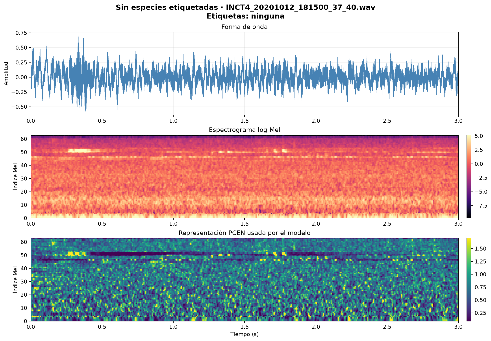
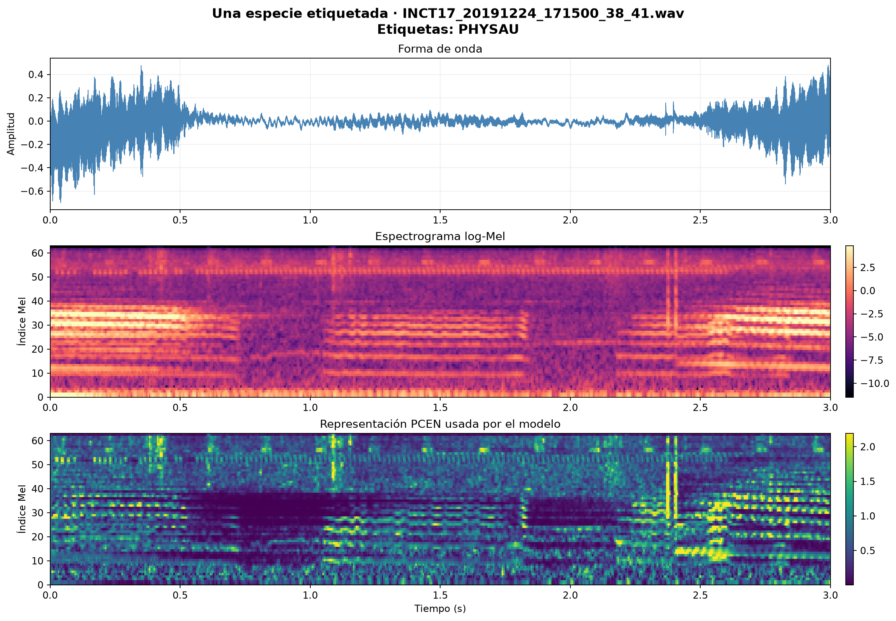
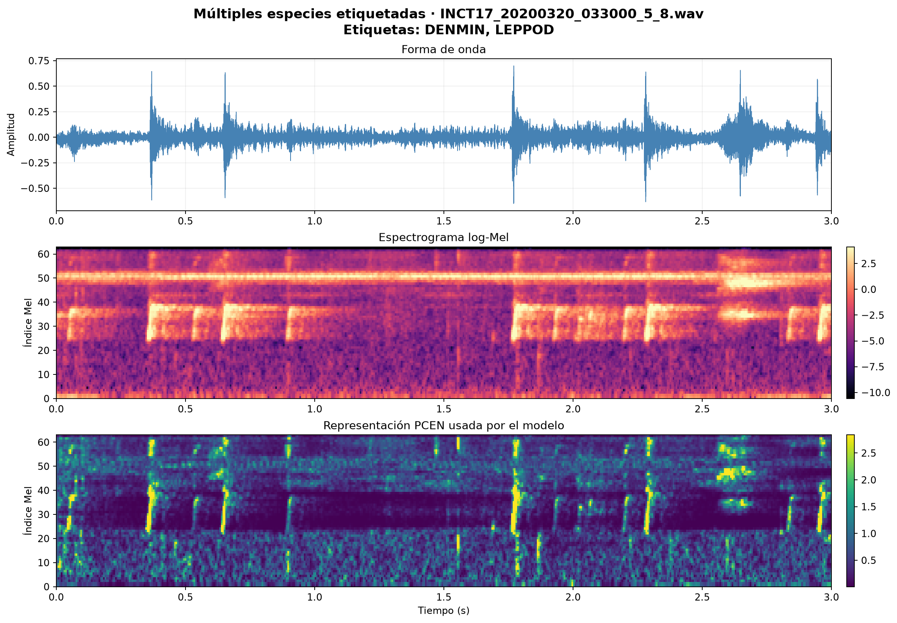
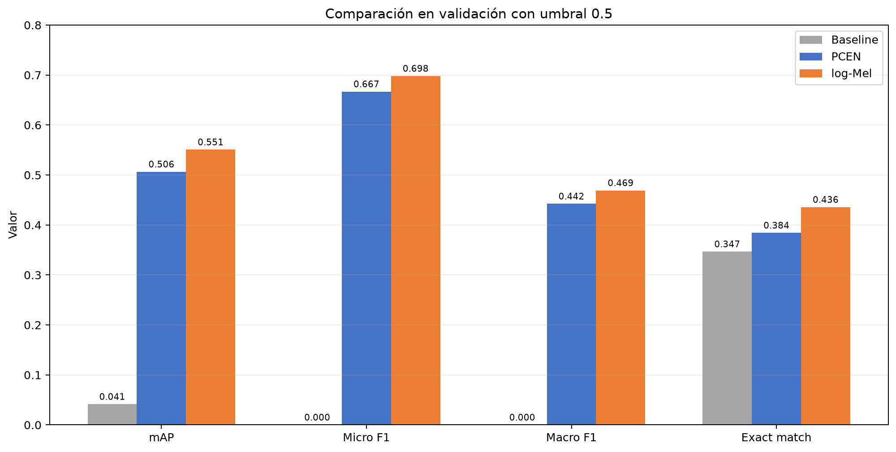
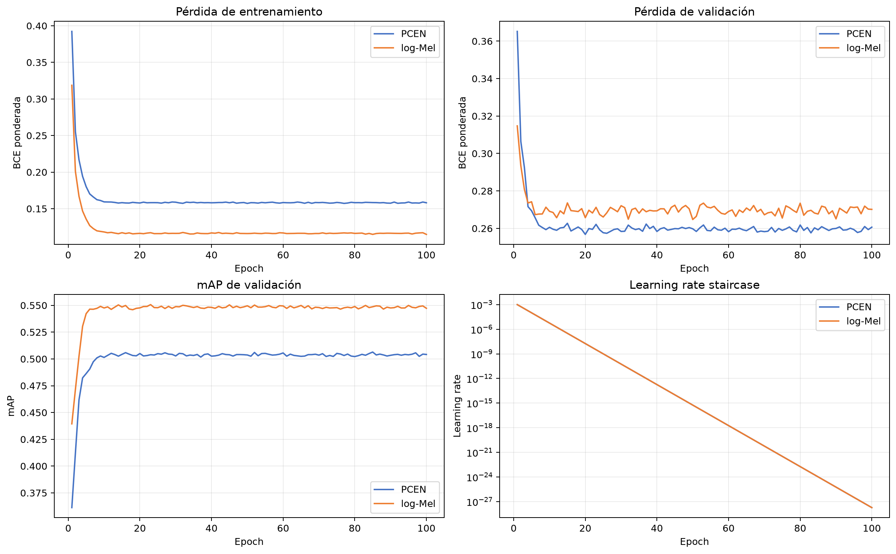
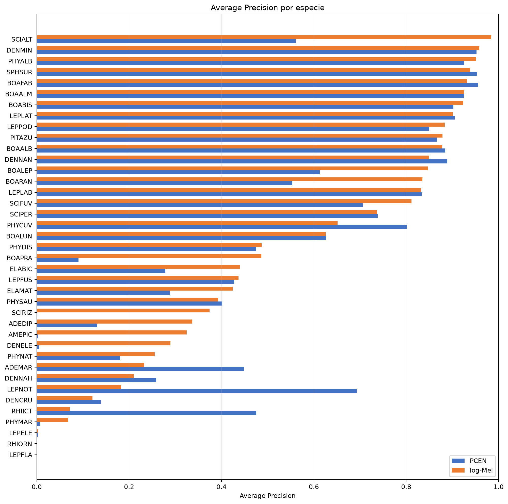
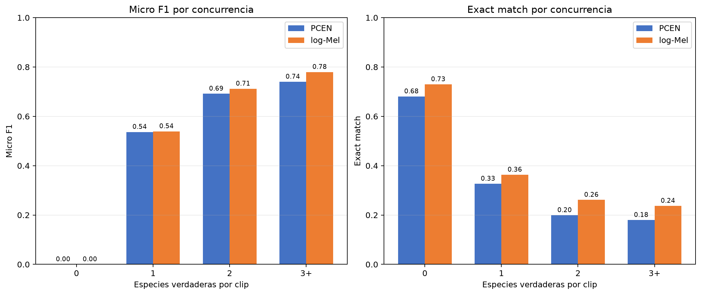
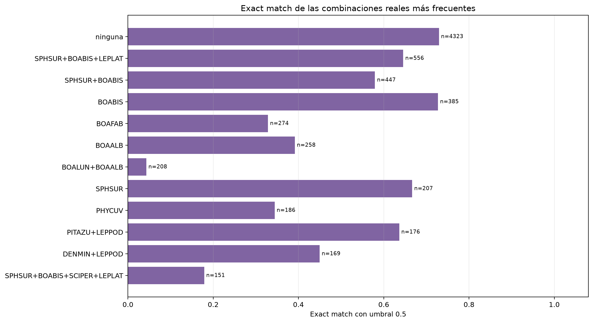
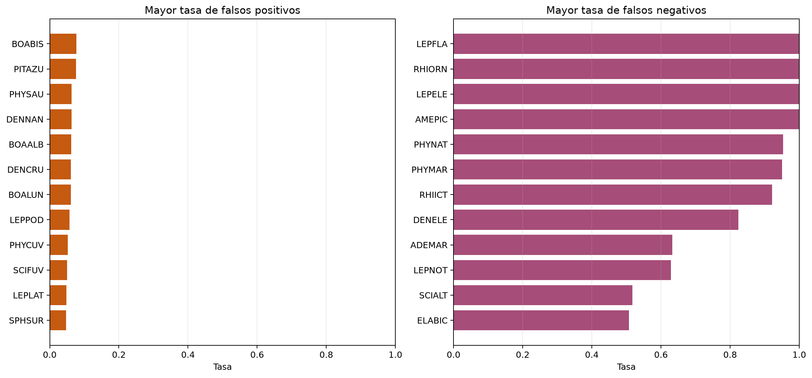
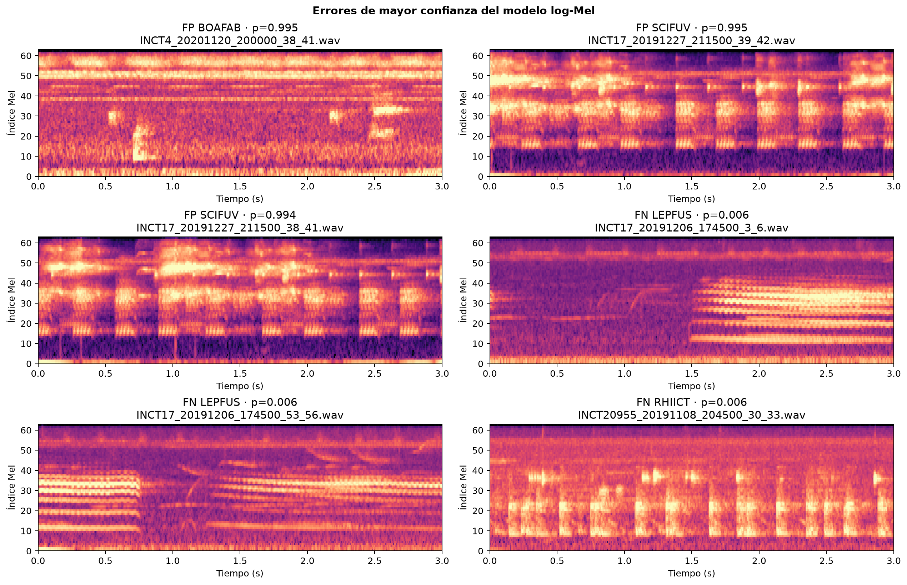

## 1. Método seleccionado

El trabajo implementa únicamente **Neural Discriminative Dimensionality
Reduction Multi-Task Learning (NDDR-MTL)**. NDDR-MTL mantiene una ruta de
características específica para cada tarea y permite intercambio controlado de
información entre las rutas mediante convoluciones `1×1` aprendibles.

Para cada etapa convolucional, las características de las $K$ tareas se
concatenan en la dimensión de canales:

$$
\mathbf{X}=\operatorname{Concat}\left(\mathbf{X}_1,\mathbf{X}_2,\ldots,
\mathbf{X}_K;\ \mathrm{canales}\right).
$$

Cada tarea $k$ obtiene una representación propia mediante BN y una convolución
`1×1` aprendible:

$$
\mathbf{Y}_k=\operatorname{Conv}^{(k)}_{1\times1}
\left(\operatorname{BN}(\mathbf{X})\right).
$$

Si cada rama contiene $C$ canales, la inicialización de esa proyección puede
escribirse por bloques como:

$$
\mathbf{W}_k=
\left[\alpha_{k1}\mathbf{I}_C\mid\alpha_{k2}\mathbf{I}_C\mid\cdots\mid
\alpha_{kK}\mathbf{I}_C\right],
\qquad
\alpha_{kj}=
\begin{cases}
0.6, & j=k,\\
\dfrac{0.4}{K-1}, & j\ne k.
\end{cases}
$$

Así se favorece la propia tarea sin eliminar el intercambio con especies que
aparecen simultáneamente. Para construir el shortcut de la tarea $k$, primero
se redimensionan las tres salidas NDDR a la resolución de la tercera etapa:

$$
\widetilde{\mathbf{Y}}_k^{(s)}=
\operatorname{Resize}_{\mathrm{bilinear}}
\left(\mathbf{Y}_k^{(s)},\operatorname{shape}(\mathbf{Y}_k^{(3)})\right),
\qquad s\in\{1,2,3\}.
$$

Luego se concatenan y se reducen de $3C$ a $C$ canales mediante otra
convolución `1×1`:

$$
\mathbf{Z}_k=\operatorname{Conv}^{(k)}_{1\times1}
\left(\operatorname{BN}\left(
\operatorname{Concat}(\widetilde{\mathbf{Y}}_k^{(1)},
\widetilde{\mathbf{Y}}_k^{(2)},
\widetilde{\mathbf{Y}}_k^{(3)})\right)\right),
$$

inicializada con:

$$
\mathbf{W}^{\mathrm{skip}}_k=
\left[0.2\mathbf{I}_C\mid0.2\mathbf{I}_C\mid0.6\mathbf{I}_C\right].
$$

## 2. Arquitectura y pipeline implementado

El siguiente diagrama muestra el `forward` real del modelo. `B` representa el
tamaño del batch; los tensores espectrales siguen el orden `[B, canales,
frecuencia, tiempo]`. Aunque las convoluciones se ejecutan de forma agrupada
para aprovechar la GPU, las 42 ramas conservan parámetros independientes.

<!-- markdownlint-disable MD013 MD060 -->

```{mermaid}
flowchart TD
    A["WAV mono: 3 s, 22.05 kHz, 66150 muestras"] --> B["STFT: FFT 512, hop 128, 513 frames"]
    B --> C["64 bandas Mel y PCEN, repetido en 3 canales"]
    C --> D["Entrada: B × 3 × 64 × 513"]
    D --> E["42 ramas específicas; una ruta CNN por especie"]

    E --> C1["CNN 1 por especie: Conv 5×5, 3→4, padding 2; BN, ReLU, MaxPool 5×1, Dropout2d 0.25"]
    C1 --> C1O["42 salidas: cada una B × 4 × 12 × 513"]
    C1O --> N1C["NDDR 1: concatenación en canales, B × 168 × 12 × 513; BN"]
    N1C --> N1["42 Conv 1×1 específicas, 168→4; init propia 0.6 y ajenas 0.4/41"]

    N1 --> C2["CNN 2 por especie: Conv 5×5, 4→4, padding 2; BN, ReLU, MaxPool 4×1, Dropout2d 0.25"]
    C2 --> C2O["42 salidas: cada una B × 4 × 3 × 513"]
    C2O --> N2C["NDDR 2: concatenación en canales, B × 168 × 3 × 513; BN"]
    N2C --> N2["42 Conv 1×1 específicas, 168→4; misma inicialización diagonal"]

    N2 --> C3["CNN 3 por especie: Conv 5×5, 4→4, padding 2; BN, ReLU, MaxPool 2×1, Dropout2d 0.25"]
    C3 --> C3O["42 salidas: cada una B × 4 × 1 × 513"]
    C3O --> N3C["NDDR 3: concatenación en canales, B × 168 × 1 × 513; BN"]
    N3C --> N3["42 Conv 1×1 específicas, 168→4; misma inicialización diagonal"]

    N1 -. "Bilinear: frecuencia 12→1" .-> S
    N2 -. "Bilinear: frecuencia 3→1" .-> S
    N3 -. "Ya tiene frecuencia 1" .-> S
    S["Shortcut por especie: concatenar NDDR 1, 2 y 3; B × 12 × 1 × 513"]
    S --> SF["BN y Conv 1×1 específica 12→4; init por etapas 0.2, 0.2, 0.6"]
    SF --> R["Time-distributed flatten: B × 513 × 4"]
    R --> G1["BiGRU 1 específica: 16 por dirección, dropout entrada 0.2; promedio → B × 513 × 16"]
    G1 --> G2["BiGRU 2 específica: 16 por dirección, dropout entrada 0.2; promedio"]
    G2 --> G3["BiGRU 3 específica: 16 por dirección, dropout entrada 0.2; promedio"]
    G3 --> T["Temporal max pooling sobre 513 frames: B × 16"]
    T --> L["Linear específica 16→1 para cada especie"]
    L --> O["Apilar 42 logits independientes: B × 42"]
    O --> P["Sigmoid en inferencia; BCEWithLogitsLoss en entrenamiento"]
```

Cada bloque CNN ejecuta, en este orden:

1. Convolución `5×5` con zero-padding de 2.
2. Batch normalization específica de la rama.
3. ReLU.
4. Max pooling no solapado.
5. `Dropout2d` con tasa 0.25.
6. Concatenación de las 42 ramas, otro BN y fusión NDDR mediante convoluciones
   `1×1` específicas de cada tarea.

Después de la tercera etapa, las salidas de las tres capas NDDR se redimensionan
a la resolución de la última etapa y se fusionan con pesos iniciales
`[0.2, 0.2, 0.6]`. Esta es una inicialización aprendible de la convolución
`1×1`: prioriza la última representación, pero Adam puede modificar todos sus
pesos. Cada especie termina con tres BiGRU propias. Las dos direcciones se
promedian después de cada GRU, se aplica temporal max pooling y se produce un
logit.

### Dimensiones durante el `forward`

Para una entrada de tres segundos, las formas del modelo configurado con 42
tareas, 4 canales CNN y 16 unidades GRU por dirección son:

| Etapa | Operación principal | Forma por especie | Forma conjunta o concatenada |
|-------|---------------------|------------------:|-----------------------------:|
| Audio | Clip mono a 22.05 kHz | `B × 66150` | — |
| Frontend | STFT, Mel, PCEN y repetición de canales | — | `B × 3 × 64 × 513` |
| CNN 1 | Conv `5×5`, BN, ReLU, pool `(5,1)`, dropout | `B × 4 × 12 × 513` | 42 ramas independientes |
| Entrada NDDR 1 | Concatenar ramas en canales y BN | — | `B × 168 × 12 × 513` |
| Salida NDDR 1 | 42 proyecciones `1×1`, cada una `168→4` | `B × 4 × 12 × 513` | 42 salidas específicas |
| CNN 2 | Conv `5×5`, BN, ReLU, pool `(4,1)`, dropout | `B × 4 × 3 × 513` | 42 ramas independientes |
| Entrada NDDR 2 | Concatenar ramas en canales y BN | — | `B × 168 × 3 × 513` |
| Salida NDDR 2 | 42 proyecciones `1×1`, cada una `168→4` | `B × 4 × 3 × 513` | 42 salidas específicas |
| CNN 3 | Conv `5×5`, BN, ReLU, pool `(2,1)`, dropout | `B × 4 × 1 × 513` | 42 ramas independientes |
| Entrada NDDR 3 | Concatenar ramas en canales y BN | — | `B × 168 × 1 × 513` |
| Salida NDDR 3 | 42 proyecciones `1×1`, cada una `168→4` | `B × 4 × 1 × 513` | 42 salidas específicas |
| Resize de shortcuts | Interpolar NDDR 1 y 2 al tamaño de NDDR 3 | Tres tensores `B × 4 × 1 × 513` | — |
| Concatenación skip | Concatenar las tres profundidades y aplicar BN | `B × 12 × 1 × 513` | 42 shortcuts específicos |
| Fusión skip | Conv `1×1`, `12→4`, inicializada `[0.2,0.2,0.6]` | `B × 4 × 1 × 513` | 42 salidas específicas |
| Secuencia | Permutar y aplanar canales/frecuencia por frame | `B × 513 × 4` | — |
| BiGRU 1 | 16 unidades por dirección y promedio | `B × 513 × 16` | 42 rutas recurrentes |
| BiGRU 2 | 16 unidades por dirección y promedio | `B × 513 × 16` | 42 rutas recurrentes |
| BiGRU 3 | 16 unidades por dirección y promedio | `B × 513 × 16` | 42 rutas recurrentes |
| TMP | Máximo sobre los 513 frames | `B × 16` | — |
| Clasificador | Capa lineal específica `16→1` | `B × 1` | 42 clasificadores |
| Salida | Apilar logits de todas las especies | — | `B × 42` |

<!-- markdownlint-enable MD013 MD060 -->

La longitud temporal permanece en 513 porque todos los max poolings tienen
segunda componente igual a uno. Solo se reduce la frecuencia:
`64 → 12 → 3 → 1`.

## 3. Representación del audio

El paper usa MS-PCEN sobre audio de 96 kHz con:

- STFT de 2048 muestras.
- Solapamiento de 75 %.
- 64 bandas Mel.
- Tres copias del espectrograma.

Como el dataset del laboratorio usa 22.05 kHz, se preservó aproximadamente la
duración física de la ventana del paper:

| Parámetro               |  Paper | Adaptación |
|-------------------------|-------:|-----------:|
| Frecuencia de muestreo  | 96 kHz |  22.05 kHz |
| `n_fft` / ventana       |   2048 |        512 |
| Hop                     |    512 |        128 |
| Solapamiento            |   75 % |       75 % |
| Bandas Mel              |     64 |         64 |
| Frames para 3 s         |    559 |        513 |

Como la STFT se calcula sin padding central, la cantidad de frames temporales
es:

$$
T=\left\lfloor\frac{N-L}{H}\right\rfloor+1
=\left\lfloor\frac{66150-512}{128}\right\rfloor+1
=513,
$$

donde $N$ es el número de muestras, $L$ la longitud de ventana y $H$ el hop.

Parámetros PCEN:

- `offset = 0.05`
- `gain = 0.98`
- `power = 0.5`
- `eps = 1e-4`
- `smoothing = 0.967`

El suavizado temporal de la energía $E_t$ se calcula como:

$$
M_t=0.967M_{t-1}+(1-0.967)E_t
=0.967M_{t-1}+0.033E_t.
$$

La transformación PCEN implementada es:

$$
\operatorname{PCEN}(E_t)=
\left(\frac{E_t}{(\varepsilon+M_t)^{g}}+\delta\right)^r-\delta^r,
$$

con $g=0.98$, $\delta=0.05$, $r=0.5$ y $\varepsilon=10^{-4}$.

El frontend fue implementado en PyTorch, incluyendo el banco triangular Mel.
Las siguientes figuras se generaron directamente desde WAV reales con
`scripts/generate_audio_examples.py`; los PNG son solo visualizaciones y no son
la entrada almacenada del entrenamiento.

### Ejemplos reales

::: {.panel-tabset}

#### Sin especies etiquetadas



#### Una especie



#### Múltiples especies



:::

La comparación muestra que log-Mel conserva la escala logarítmica absoluta,
mientras PCEN normaliza variaciones lentas de energía y hace más visibles los
cambios acústicos locales. No debe interpretarse visualmente una banda concreta
como una especie sin contrastarla con sus etiquetas y predicciones.

## 4. Adaptación de cinco a 42 tareas

La versión principal del paper usa cinco clases, 64 canales CNN y 128 unidades
GRU, con aproximadamente 4.1 millones de parámetros. Replicar esas dimensiones
con 42 rutas incrementa notablemente memoria y tiempo porque NDDR mezcla todas
las tareas en cada etapa.

El preset del laboratorio conserva toda la estructura de NDDR-MTL pero usa:

- 42 ramas.
- 4 canales por rama.
- 16 unidades GRU por dirección.
- Tres etapas CNN y tres BiGRU.
- Aproximadamente **500,682 parámetros**.

El propio paper reporta una meseta de desempeño desde aproximadamente 410 mil
parámetros y el preset compacto queda cerca de ese conteo agregado. Esto motiva
el presupuesto, pero no demuestra capacidad equivalente: los parámetros ahora
se distribuyen entre 42 rutas y el resultado debe validarse empíricamente.

### Inicialización cruzada

Con cinco tareas, el paper usa 0.6 para la ruta propia y 0.1 para cada una de las
otras cuatro rutas; la suma es 1.0. Copiar 0.1 para 41 rutas produciría una suma
inicial de 4.7.

Para 42 tareas se mantiene 0.6 en la ruta propia y se distribuye 0.4 entre las
41 rutas restantes:

$$
w_{\mathrm{cross}}=\frac{1-0.6}{42-1}
=\frac{0.4}{41}\approx0.009756.
$$

Este cambio preserva la prioridad de la tarea y la escala total de la
inicialización original. El valor sigue siendo configurable.

## 5. Adaptación multietiqueta

La salida tiene 42 logits independientes. Un vector de ceros representa que no
se detectó ninguna especie; no se añadió una clase artificial de ruido.

Se utiliza `BCEWithLogitsLoss`, que combina sigmoid y entropía cruzada binaria
de forma numéricamente estable. Para un batch de $B$ clips y $K=42$ especies,
la pérdida ponderada es:

$$
\mathcal{L}=-\frac{1}{BK}\sum_{i=1}^{B}\sum_{k=1}^{K}
\left[p_k y_{ik}\log\sigma(z_{ik})+
(1-y_{ik})\log\left(1-\sigma(z_{ik})\right)\right],
$$

con pesos positivos calculados únicamente sobre entrenamiento:

$$
p_k=\operatorname{clip}\left(
\frac{N_{k,\mathrm{neg}}}{N_{k,\mathrm{pos}}},1,20\right).
$$

El experimento principal usa estos pesos porque el dataset entregado está
fuertemente desbalanceado. Cuando una clase no tiene positivos se asigna
$p_k=1$ para evitar una división indefinida.

Dos columnas, `SCIFUS` y `SCINAS`, no tienen ejemplos positivos en
`train.csv`. Se mantienen para conservar las 42 salidas, reciben peso 1.0 y se
reportan como clases sin soporte. No se incluyen en mAP ni en promedios macro
que requieran ejemplos positivos.

## 6. Split de entrenamiento y validación

Se utiliza 80 % para entrenamiento y 20 % para validación con semilla **42**.

Los clips son ventanas solapadas de grabaciones más largas. Por ejemplo,
`_0_3.wav` y `_1_4.wav` comparten dos segundos. Una división aleatoria por clip
produciría fuga de información.

La implementación:

1. Elimina el sufijo `_inicio_fin` para obtener el grupo de grabación.
2. Genera candidatos con `GroupShuffleSplit`.
3. Descarta candidatos que dejarían sin positivos de entrenamiento a una clase
   globalmente soportada.
4. Descarta candidatos sin soporte de validación cuando la clase aparece en al
   menos dos grabaciones independientes.
5. Verifica que ningún grupo aparezca en ambos conjuntos.
6. Reporta clases globalmente vacías, restringidas a una grabación o ausentes
   de validación.
7. Guarda el split para reutilizarlo en todos los experimentos.

## 7. Entrenamiento

### Parámetros de la ejecución principal

<!-- markdownlint-disable MD013 MD060 -->

| Parámetro | Paper | Entrenamiento realizado |
|-----------|-------|-------------------------|
| GPU | Tesla T4 de 15 GB en Colab Pro+ | NVIDIA RTX A2000 de 12 GB |
| Framework de GPU | Keras | PyTorch 2.11, CUDA 12.6 y cuDNN |
| Batch size | 16 | 64 |
| Épocas | 100 | 100 |
| Early stopping | No | No |
| Optimizador | Adam | Adam, `betas=(0.9,0.999)`, `eps=1e-8`, sin AMSGrad |
| Learning rate inicial | `0.001` | `0.001` |
| Scheduler | Exponencial staircase, factor `0.75` cada 90 pasos | Exponencial staircase, factor `0.75` cada 388 pasos |
| Pasos por época | Aproximadamente 182 en el experimento original | 777, calculados como `ceil(49721 / 64)` |
| Intervalo de decay | Aproximadamente media época | `round(777 × 0.5) = 388` pasos, aproximadamente media época |
| Pérdida | Binary cross-entropy | `BCEWithLogitsLoss` con `pos_weight` limitado a `[1,20]` |
| Precisión | No especificada | AMP float16 en CUDA con pesos maestros float32 |
| Gradient clipping | No especificado | Norma global máxima 5.0 |
| L2 NDDR | `0.01` | Weight decay `0.01` sobre pesos de convoluciones NDDR y skip `1×1` |
| Weight decay restante | No especificado | `0.0001` |

<!-- markdownlint-enable MD013 MD060 -->

El scheduler implementa exactamente una función exponencial por escalones. Si
$s$ es el número de actualizaciones completadas por Adam, la tasa es:

$$
\operatorname{lr}(s)=0.001\,(0.75)^{\left\lfloor s/388\right\rfloor}.
$$

Por tanto, la tasa permanece constante dentro de cada intervalo y cambia solo
cuando se completa otro grupo de 388 pasos:

```text
Pasos       Learning rate
0–387       0.001
388–775     0.00075
776–1163    0.0005625
1164–1551   0.000421875
```

El paper reduce la tasa cada 90 pasos. No usamos 90 literalmente porque el batch
y el número de clips producen 777 actualizaciones por época; se conserva su
cadencia relativa de aproximadamente media época. El intervalo también puede
fijarse literalmente mediante `training.lr_decay_steps`.

El batch 64 se eligió después de un benchmark de forward y backward en la RTX
A2000. Reduce una época de 6216 pasos con batch 8 a 777 pasos y cabe en sus 12 GB
de VRAM. AMP disminuye el uso de memoria y acelera las convoluciones y GRU sin
modificar la arquitectura.

Los pesos ordinarios se inicializan con Xavier/Glorot y bias cero. Los pesos
NDDR utilizan la inicialización diagonal, mientras la fusión de shortcuts parte
de `[0.2, 0.2, 0.6]`. Se guarda `best.pt` según mAP de validación y `last.pt` al
final de cada época. No se utiliza early stopping, siguiendo la decisión del
paper.

### Registro completo de decisiones de adaptación

La siguiente tabla diferencia explícitamente los parámetros originales de las
adaptaciones utilizadas. Las decisiones no listadas como cambio conservan la
propuesta del paper.

<!-- markdownlint-disable MD013 MD060 -->

| Componente | Paper | Implementación | Justificación |
|------------|-------|----------------|---------------|
| Número de tareas | 5 eventos marinos | 42 especies | Es el espacio de etiquetas requerido por el laboratorio. |
| Canales CNN por rama | 64 | 4 | NDDR crece aproximadamente con `K²C²`. Con 42 tareas, 64 canales elevarían mucho los parámetros, activaciones y tiempo. Se conserva toda la topología NDDR con un ancho entrenable. |
| Unidades por BiGRU | 128 | 16 | Hay 126 BiGRU específicas, frente a 15 en el paper. La reducción limita memoria y tiempo manteniendo tres capas bidireccionales por tarea. |
| Inicialización cruzada NDDR | 0.1 para cada una de 4 tareas ajenas | `0.4 / 41 = 0.009756` para cada tarea ajena | Mantiene 0.6 para la tarea propia y una suma total inicial de 1.0. Copiar 0.1 en 41 entradas produciría una suma de 4.7 y cambiaría la escala de activaciones. |
| Inicialización skip | 0.2, 0.2 y 0.6 | Igual | Se conserva la prioridad de las características más recientes. |
| Kernel y pooling CNN | `5×5`; `(5,1)`, `(4,1)`, `(2,1)` | Igual | Componente estructural central de la CRNN del paper. |
| Bloques CNN y BiGRU | 3 CNN y 3 BiGRU | Igual | Se conserva la profundidad propuesta. |
| Entrada espectral | MS-PCEN, 96 kHz, FFT 2048, hop 512 | MS-PCEN, 22.05 kHz, FFT 512, hop 128 | El dataset fija 22.05 kHz. La reducción conserva una ventana de aproximadamente 23 ms y el solapamiento de 75 %. |
| Frames STFT | 559 | 513 | Consecuencia de adaptar FFT/hop a 22.05 kHz y usar STFT sin padding central. |
| Canales de entrada | MS-PCEN repetido 3 veces | Igual | Se conserva la formulación del paper, aunque las copias se generan en memoria y no se almacenan. |
| Batch size | 16 | 64 | La RTX A2000 usa aproximadamente 5.84 GiB con batch 64. El batch mayor reduce una época de 6216 a 777 pasos y mejora sustancialmente el tiempo sin cambiar el modelo. |
| Épocas | 100 | 100 | Se conserva el presupuesto del paper. |
| Early stopping | No | No | Se conserva la decisión del paper por la presencia potencial de mínimos locales múltiples. |
| Optimizador | Adam | Adam | Se conserva el optimizador propuesto. |
| Learning rate | 0.001 | 0.001 | Se conserva la tasa inicial. |
| Decaimiento | `0.75` staircase cada 90 pasos | `0.75` staircase cada media época, aproximadamente 388 pasos con batch 64 | En el paper, 90 pasos equivalen aproximadamente a media época. Usar 90 literalmente sobre 777 pasos por época reduciría el LR unas 8 veces por época y lo llevaría casi a cero prematuramente. Se conserva la cadencia relativa al dataset. |
| Pérdida | BCE | `BCEWithLogitsLoss` | Es la combinación numéricamente estable de sigmoid y BCE para 42 logits independientes. |
| Balance de pérdida | Dataset curado; BCE sin pesos | `pos_weight = negativos / positivos`, limitado a `[1,20]` | El dataset amazónico está fuertemente desbalanceado y no fue curado como el del paper. El límite evita gradientes extremos en especies muy raras. |
| Clases sin positivos | No aplica al dataset curado | `SCIFUS` y `SCINAS` se mantienen con peso 1 | Se debe conservar el formato de 42 salidas, aunque no pueden aprenderse supervisadamente. Se excluyen de mAP y promedios macro que requieren positivos. |
| Regularización NDDR | L2 de 0.01 en pesos `1×1` | Igual | Se conserva la regularización específica del método. |
| Regularización restante | No indicada | Weight decay `1e-4` | Regularización moderada para un dataset desbalanceado; queda separada del L2 de 0.01 de NDDR. |
| Gradient clipping | No indicado | Norma máxima 5.0 | Reduce el riesgo de explosión de gradientes en las 126 capas recurrentes. |
| Precisión numérica | No indicada | AMP en CUDA | Reduce memoria y acelera convoluciones/GRU. No altera capas, logits ni función objetivo; los pesos maestros permanecen en float32. |
| Split | 4 folds balanceados | Un split 80/20, semilla 42 | Es el protocolo solicitado por el profesor. Se agrupa por grabación para impedir fuga entre ventanas solapadas. |
| Selección del split | Dataset curado | 4096 candidatos group-aware | Permite aproximar prevalencias y exigir soporte en train/validación cuando existen al menos dos grabaciones positivas. |
| Selección de checkpoint | Entrenamiento fijo por fold | Mejor mAP de validación más `last.pt` | Conserva un modelo útil para inferencia y permite reanudar interrupciones; se reporta que la validación también participa en selección. |
| Umbral principal | 0.5 | 0.5 | Se conserva para comparabilidad. Los umbrales optimizados se reportan aparte y se estiman solo en validación. |
| Backend CUDA | No relevante | PyTorch CUDA 12.6 | CUDA 12.8 presentó incompatibilidad cuBLASLt con la workstation; 12.6 coincide con el sistema instalado y pasó forward/backward cuDNN. |

<!-- markdownlint-enable MD013 MD060 -->

El preset compacto tiene 500,682 parámetros. Esta cifra no implica equivalencia
de capacidad con los modelos de cinco tareas del paper: se usa como compromiso
computacional y debe juzgarse mediante los resultados de validación y la
ablación.

## 8. Ablación

La ablación obligatoria mantiene constantes:

- Split.
- NDDR-MTL.
- Semilla.
- Tamaño de modelo.
- Optimizador.
- Número máximo de épocas.

Solo cambia la representación:

| Experimento | Representación | Configuración              |
|-------------|----------------|----------------------------|
| Principal   | MS-PCEN        | `configs/nddr_pcen.yaml`   |
| Ablación    | log-Mel        | `configs/nddr_logmel.yaml` |

Esto mide el aporte de la normalización de energía propuesta en el pipeline del
paper.

## 9. Métricas

Métricas del paper:

- Accuracy por decisión de etiqueta.
- Exact match.
- Curvas precision-recall.
- Average precision por clase.

Métricas adicionales:

- mAP sobre clases con soporte.
- Micro/macro precision, recall y F1.
- Hamming loss.
- Métricas por concurrencia: 0, 1, 2 y 3+ especies.
- Baseline que siempre predice el vector de ceros.

Se reporta el umbral fijo 0.5 para comparabilidad con el paper. La optimización
por clase se calcula solo sobre validación y se reporta por separado. Los
umbrales pueden cambiar F1, exact match y accuracy, pero no AP/mAP, que se
calculan directamente a partir del ranking de probabilidades.

A diferencia del paper, el protocolo requerido por el laboratorio usa un solo
split 80/20 y no cuatro folds. El mejor checkpoint se selecciona por mAP en ese
mismo conjunto de validación, por lo que sus métricas son apropiadas para
selección de modelo pero no equivalen a una estimación independiente de test.

## 10. Resultados

Todos los resultados siguientes corresponden al split fijo de validación, al
mejor checkpoint seleccionado por mAP y a un umbral de decisión de 0.5. El mAP
se calcula sobre las 39 clases con al menos un positivo en validación.

### Comparación global

<!-- markdownlint-disable MD013 MD060 -->

| Sistema | Mejor epoch | mAP | Micro F1 | Macro F1 | Exact match | Label accuracy | Hamming loss |
|---------|-------------:|----:|---------:|---------:|------------:|---------------:|-------------:|
| Vector de ceros | — | 0.04143 | 0.00000 | 0.00000 | 0.34667 | 0.96153 | 0.03847 |
| NDDR-MTL + PCEN | 85 | 0.50641 | 0.66684 | 0.44231 | 0.38412 | 0.96522 | 0.03478 |
| NDDR-MTL + log-Mel | 23 | **0.55069** | **0.69797** | **0.46905** | **0.43561** | **0.97088** | **0.02912** |

<!-- markdownlint-enable MD013 MD060 -->



Log-Mel mejora frente a PCEN en 0.04428 mAP, 0.03113 micro F1, 0.02674
macro F1 y 0.05148 exact match. También reduce Hamming loss en 0.00566. La
mejora relativa de mAP es aproximadamente 8.7 %. El modelo log-Mel aumenta
precision micro de 0.52798 a 0.58062, aunque reduce recall micro de 0.90480 a
0.87477; por tanto, elimina falsos positivos a cambio de omitir algunos
positivos adicionales.

La alta accuracy del baseline no representa reconocimiento útil: 96.15 % de
las decisiones individuales se aciertan prediciendo siempre ausencia debido al
desbalance, pero su micro F1 es cero y su mAP es solo 0.04143. Esto justifica
priorizar mAP, F1 y exact match sobre accuracy aislada.

### Dinámica de entrenamiento



Ambos modelos convergen durante los primeros epochs. El scheduler reduce la
tasa dos veces por época y la lleva prácticamente a cero muy pronto; después de
ese punto las oscilaciones de las métricas no corresponden a actualizaciones
relevantes. Los historiales no permiten atribuir una causa única a esas
oscilaciones. Los 100 epochs se conservaron para seguir el presupuesto acordado,
pero esta curva indica que un scheduler más lento sería
una mejora metodológica importante.

## 11. Resultado de la ablación

La ablación muestra que PCEN no mejora este experimento: log-Mel obtiene mejor
resultado agregado manteniendo constantes arquitectura, split, semilla,
optimizador y presupuesto. Sin embargo, el efecto no es uniforme entre clases.



Las mayores ganancias de AP con log-Mel son:

| Especie | $\Delta AP$ log-Mel − PCEN |
|---------|----------------------------:|
| SCIALT | +0.42330 |
| BOAPRA | +0.39625 |
| SCIRIZ | +0.37287 |
| AMEPIC | +0.32194 |
| DENELE | +0.28349 |

Las mayores pérdidas son:

| Especie | $\Delta AP$ log-Mel − PCEN |
|---------|----------------------------:|
| LEPNOT | −0.51112 |
| RHIICT | −0.40386 |
| ADEMAR | −0.21572 |
| PHYCUV | −0.15017 |
| DENNAH | −0.04842 |

Por ello, el resultado no implica que log-Mel sea universalmente superior:
PCEN favorece varias especies concretas, posiblemente por diferencias en
estacionariedad, intensidad o ruido de fondo. Con una sola semilla no se puede
cuantificar la variabilidad estadística de estas diferencias.

## 12. Resultados por concurrencia



Log-Mel iguala o supera a PCEN en todos los grupos. El micro F1 aumenta con la
cantidad de etiquetas positivas, pero exact match cae: log-Mel obtiene
aproximadamente 0.73 para clips vacíos y 0.24 para clips con tres o más
especies. Exact match exige acertar simultáneamente las 42 decisiones, por lo
que una sola inserción u omisión invalida todo el clip.

Las combinaciones más frecuentes también presentan dificultad desigual:



El vector vacío es la combinación más frecuente, con 4323 clips y exact match
de 0.72959. Entre combinaciones no vacías, `BOAFAB` obtiene 0.32847 y
`BOALUN+BOAALB` cerca de 0.04, mientras `BOABIS` alcanza 0.72727. Esto confirma
que la concurrencia por sí sola no explica el error; también importan la
identidad y coocurrencia de las especies.

## 13. Análisis de errores



Las tasas más altas de falsos positivos corresponden a `BOABIS` (7.71 %),
`PITAZU` (7.59 %), `PHYSAU` (6.35 %), `DENNAN` (6.34 %) y `BOAALB` (6.19 %).
En clips verdaderamente vacíos, la inserción incorrecta más común es `BOAALB`.

`AMEPIC`, `LEPELE`, `RHIORN` y `LEPFLA` tienen 100 % de falsos negativos con
umbral 0.5, pero cuentan con solo 32, 30, 11 y 3 positivos respectivamente. La
escasez vuelve estas tasas inestables. `PHYNAT` es un caso más preocupante:
omite 203 de sus positivos, equivalente a 95.31 %.



Dos de los tres falsos positivos seleccionados aparecen en ventanas consecutivas
de una misma grabación. En ese caso concreto, la repetición sugiere una confusión
sistemática o posibles omisiones de etiquetado, no un error aislado. Los falsos negativos muestran
patrones tonales visibles, pero esos patrones pueden solaparse con otras clases
o corresponder a eventos débiles dentro del clip. Sin revisar el audio y la
anotación original no se puede atribuir causalidad solo a partir del
espectrograma.

## 14. Limitaciones

- Se utilizó un único split y una única semilla; no hay intervalos de confianza.
- `SCIFUS` y `SCINAS` no tienen positivos globales, y `RHISCI` no tiene positivos
  en validación. No es posible estimar AP para estas tres clases.
- El dataset está fuertemente desbalanceado y exact match está influido por los
  4323 clips sin especies etiquetadas.
- Los umbrales optimizados por clase mejoraron macro F1 de 0.46905 a 0.58483,
  pero redujeron micro F1 a 0.41339, elevaron Hamming loss a 0.08985 y produjeron
  exact match cero. Por transparencia, los resultados principales y las
  predicciones de test usan 0.5.
- El learning rate decay resultó demasiado agresivo y dejó de producir cambios
  relevantes mucho antes del epoch 100.
- Reducir de 64 a 4 canales CNN y de 128 a 16 unidades GRU hace viable el modelo,
  pero limita su capacidad respecto al paper.
- Las tres entradas espectrales son copias del mismo MS-PCEN/log-Mel; repetirlas
  no agrega información nueva.
- Test no tiene etiquetas, por lo que no permite calcular métricas finales.
- Los códigos de especie no incluyen una tabla de nombres comunes o científicos.

## 15. Artefactos y predicciones de test

El análisis reproducible se genera con `scripts/generate_analysis.py`. Los
resultados compactos y gráficos están versionados en `results/`. Los artefactos
completos de cada experimento permanecen en `artifacts/experiments/`.

El mejor modelo final es NDDR-MTL + log-Mel, checkpoint del epoch 23. Se generaron
probabilidades y decisiones con umbral 0.5 para los 31,187 clips de test:

- `artifacts/experiments/nddr_logmel/test_probabilities.csv`.
- `artifacts/experiments/nddr_logmel/test_predictions.csv`.

Cada tabla conserva el orden de las 42 etiquetas del checkpoint. Las
probabilidades permiten aplicar otros umbrales posteriormente sin repetir la
inferencia.
